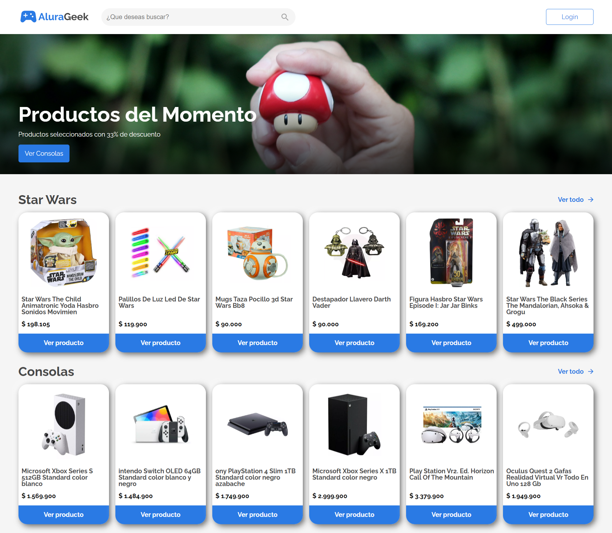

# E-commerce Alura Geek

  

<h1>Este Repositorio hace parte de challenge #2 de oracle next education en alianza con Alura Latam</h1>
  
<h2>

[Puedes probarlo aqui!](https://alexrencar.github.io/EcommerceCrud/)

</h2>

  

<h2>Secciones</h2>

* Inicio
* Login
* Buscar productos
* Ver detalle productos
* Administrar productos
* Agregar productos
* Editar productos
* Eliminar productos

  

<h2>🛠️ Construido con</h2> 

* Html
* Css (Grid y Flexbox)
* Javascript
* JSON - Api Rest

  

<h3>Gracias!!</h3>

Agradezco al programa de Oracle ONE next Education y a Alura Latam por permitirme crecer y aprender de la mano de tan excelentes maestros, realmente estoy muy contento con las nuevas cosas que estoy aprendiendo y con los retos propuestos que me han impulsado a investigar y 

  

  
  
  
  [AlexRencar](https://github.com/AlexRencar)

